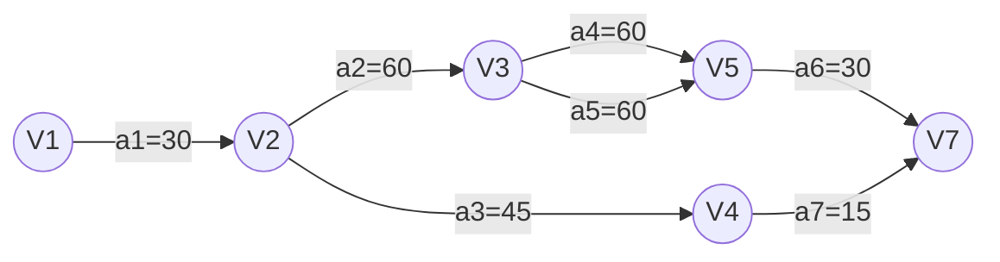

# 关键路径

**关键路径**：在[[网#AOE网|AOE网]]中，从源点到汇点据有最大路径长度的路径
- **事件**：表示之前的活动已经完成，之后的活动可以开始
- **源点**：入度为0的顶点
- **汇点**：出度为0的顶点，只有一个
- *路径长度*：路径上各个活动持续时间之和
- 关键活动：关键路径上的活动，即$l(i)==e(i)$的活动

## 流程
1. 设活动 `ai`用弧 $<j,k>$表示，其持续时间记录为$W_{j,k}$

2. 从$ve(1)=0$开始向前递推
	- $ve(j)=\max_{i}\{ve(i)+W_{i,j}\},<i,j>\in T,2\leq j\leq n$
	- 其中$T$是所有以$j$为头的弧的集合
3. 从$vl(n)=ve(n)$开始后递推
	- $vl(j)=\min_{j}\{ve(i)-W_{i,j}\},<i,j>\in S,1\leq i\leq n-1$
	- 其中$S$是所有以$i$为头的弧的集合
4. 则有
	- $e(i)=ve(j)$
	- $l(i)=vl(k)-W_{j,k}$
5. 则得到关键活动$l(i)-e(i)=0$

## 原理

- 若网中有几条关键路径，则需加快同时在几条关键路径上的关键活动。
- 如果一个活动处于所有的关键路径上，那么提高这个活动的速度，就能缩短整个工程的完成时间
- 处于所有的关键路径上的活动完成时间不能缩短太多
	- 否则会使原来的关键路径变成不是关键路径
	- 这时必须重新寻找关键路径

## 举例

| 活动代码 | 活动描述  | 历时  | 前置任务  |
| ---- | ----- | --- | ----- |
| a1   | 菜单制定  | 30  |       |
| a2   | 原材料采购 | 60  | a1    |
| a3   | 餐具准备  | 45  | a1    |
| a4   | 甜点准备  | 60  | a2    |
| a5   | 原料清晰  | 60  | a2    |
| a6   | 烹饪    | 30  | a4，a5 |
| a7   | 桌椅布置  | 15  | a3    |
| a8   | 宴会开始  | 0   | a6，a7 |

| 顶点  | 事件`vj`的最早发生时间$ve(vj)$ | 事件`vj`的最迟发生时间$vl(vj)$ |
| --- | --------------------- | --------------------- |
| v1  | 0                     | 0                     |
| v2  | 30                    | 30                    |
| v3  | 90                    | 90                    |
| v4  | 75                    | 165                   |
| v5  | 150                   | 150                   |
| v7  | 180                   | 180                   |

| 活动 代码 | 活动`ai`最早 开始时间$e(i)$ | 活动`ai`最晚 开始时间$l(i)$ | 完成活动 `ai` 时间余量$l(i)-e(i)$ |
| -------- | ---------------------- | ---------------------- | ---------------------------- |
| a1       | 0                      | 0                      | 0                            |
| a2       | 30                     | 30                     | 0                            |
| a3       | 30                     | 120                    | 90                           |
| a4       | 90                     | 90                     | 0                            |
| a5       | 90                     | 90                     | 0                            |
| a6       | 150                    | 150                    | 0                            |
| a7       | 75                     | 145                    | 70                           |

- 路径为$a_{1}\to a_{2}\to a_{4}\to a_{6}$
- 或$a_{1}\to a_{2}\to a_{5}\to a_{6}$

