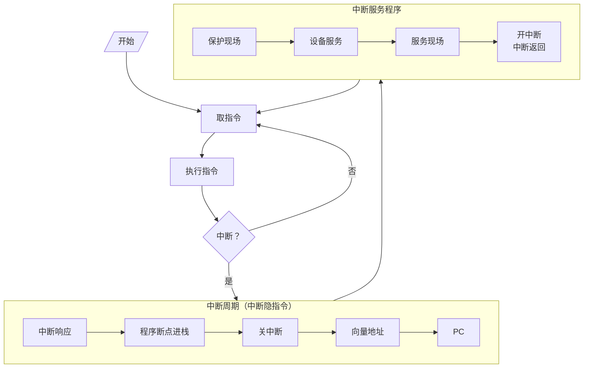
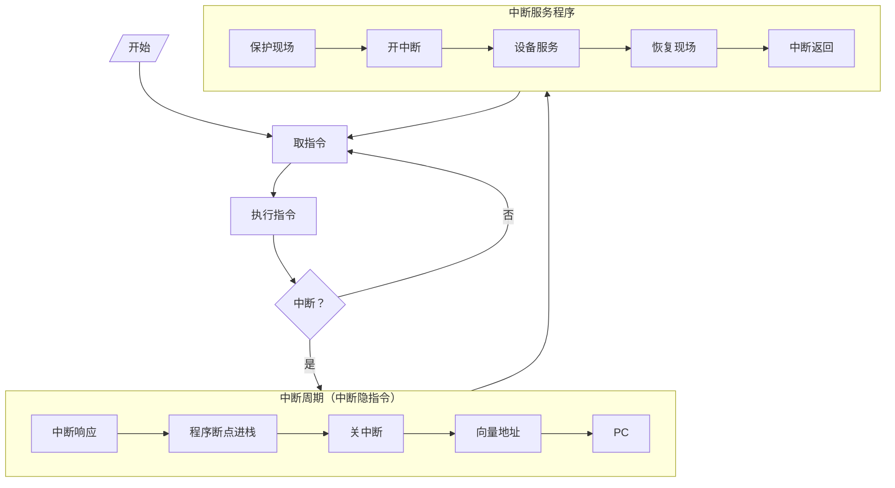

# 多重中断

多重中断：CPU 在执行中断服务程序的过程中，如果产生新的优先级更高的中断源，当前中断程序会中断，而执行新的中断服务程序，允许级别更高的中断源中断现行的中断程序

> 类似协程工作原理

程序断点 k+1，l+1，m+1

## 条件

- 提前设置开中断指令
- 优先级别高的中断源有权中断优先级别低的中断源

## 断点保护

- 断点进栈：中断隐指令完成
- 断点存入“0”地址：中断隐指令完成

中断周期
- 0->MAR
- 命令存储器写
- PC->MDR 断点->MDR
- (MDR)->存入存储器

三次中断，则三个断点都存入“0”地址

### 程序断点存入“0”地址的断点保护

| 地址   | 内容          | 说明                   |
| ------ | ------------- | ---------------------- |
| 0      | xxxx          | 存程序断点             |
| 5      | `JMP SERVE`   | 5 为向量地址            |
| SERVE  | `STA SAVE`    | 保护现场               |
|        | 。。。        |                        |
|        | `LDA 0`       | 0 地址内容转存          |
|        | `STA RETURN`  | 0 地址内容转存          |
|        | `ENI`         | 置屏蔽字后，开中断     |
|        | 。。。        | 其他服务内容           |
|        | `LDA SAVE`    | 恢复现场               |
|        | `JMP @RETURN` | 恢复屏蔽字后，间址寻址 |
| SAVE   | xxxx          | 存放 ACC 内容            |
| RETURN | xxxx          | 转存 0 地址内容          |
## 单重与多重中断流程
### 单重中断服务程序流程

### 多重中断服务程序流程

