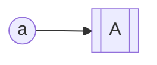

---
tags:
  - 类型/日记
begin: 2025-02-22 11:44
---

# 日记

## 任务

## 灵感随笔

```cpp
#include<iostream>
printf("Hello world!\n");
std::cout<<"Hello world!"<<std::endl;
```


```java
public class HelloWorld {
    public static void main(String[] args) {
        System.out.println("Hello World");
    }
}
```

```bash
ls .
```

```python
print("Hello world!")
```


## 总结