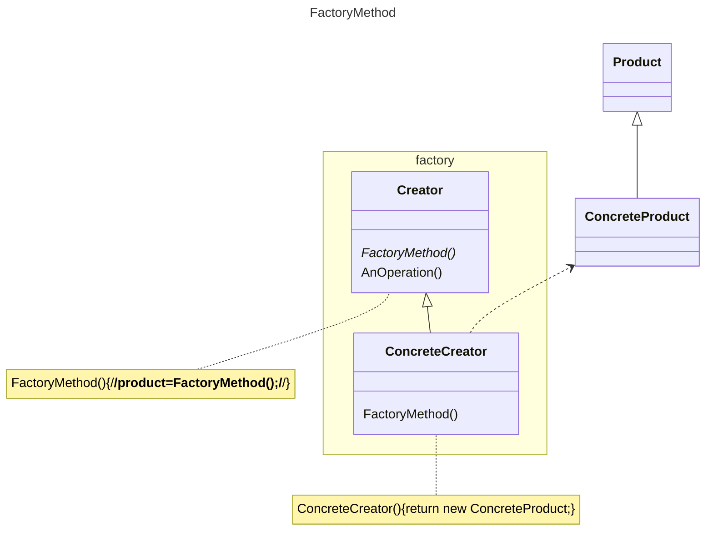
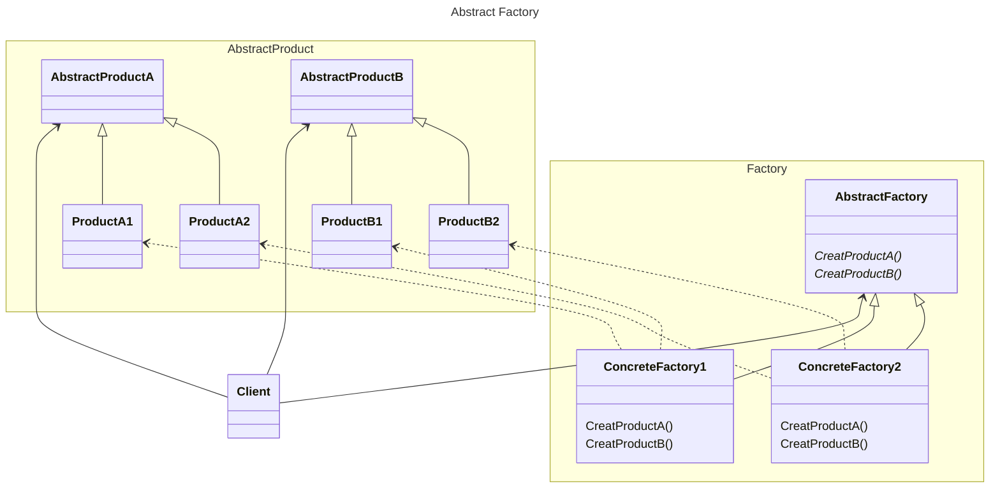
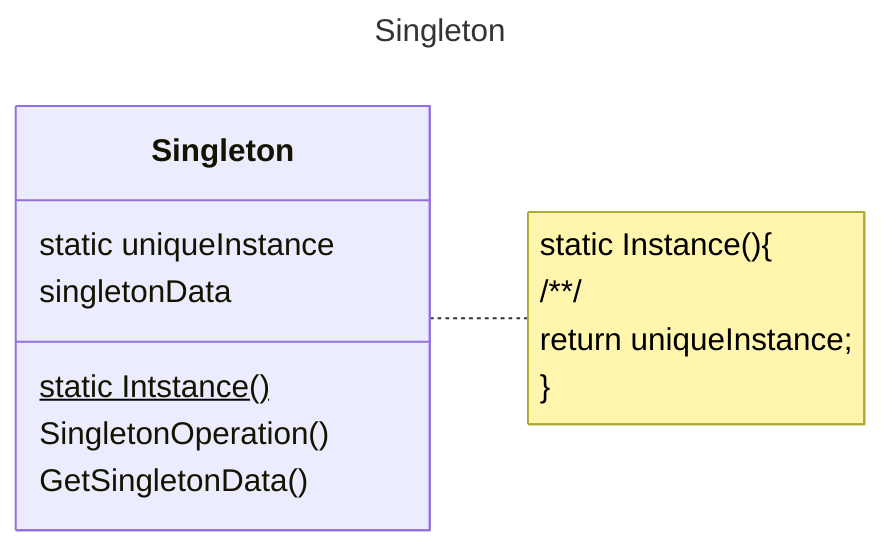
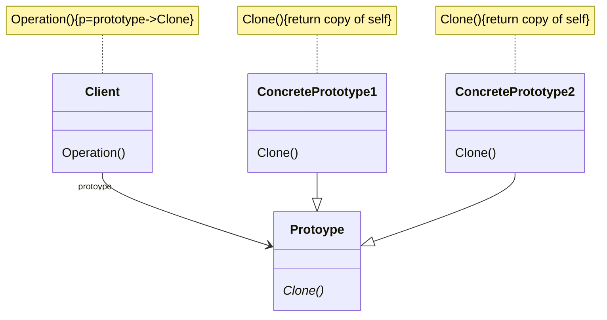
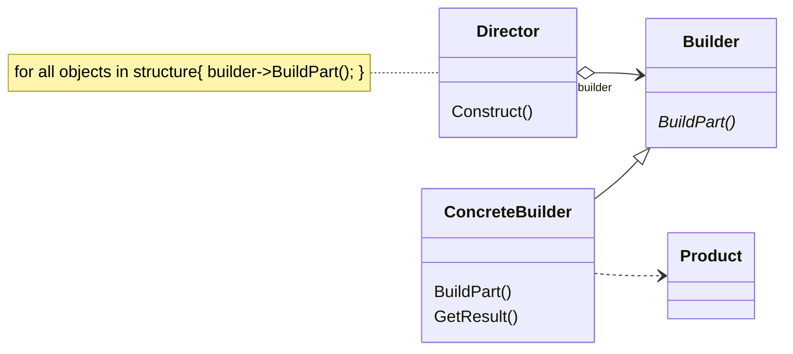

# 创建型模式

## 工厂方法(Factory Method)

工厂方法Factory Method：定义一个用于创建对象的接口，让子类决定实例化哪一个类。Factory Method使得一个类的实例化延迟（用虚函数解耦）到子类。
- 注：用于管理对象、创建对象、释放对象的操作
- 在软件系统中，经常面临着创建对象的操作；
- 由于需求的变化，需要创建的对象的具体类型经常变化。



```C++
//拆分器
class ISplitter {
public:
  virtual void split() = 0;
  virtual ~ISplitter() {}
};
//工厂基类
class SplitterFactory {
public:
  virtual ISplitter* createSplitter() = 0;
  virtual ~ISplitterFactory() {}
};
//二进制文件拆分器
class BinaryFileSplitter: public ISplitter {};
//二进制拆分器工厂
class BinarySplitterFactory: public SplitterFactory {
public:
  Splitter* createSplitter()override {
    return new BinaryFileSplitter()
  }
};
class TxtFileSplitter: public ISplitter {};
class TxtSplitterFactory: public SplitterFactory {
public:
  Splitter* createSplitter()override {
    return new TxtFileSplitter()
  }
};
class PictureFileSplitter: public ISplitter {};
class PictureSplitterFactory: public SplitterFactory {
public:
  Splitter* createSplitter()override {
    return new PictureFileSplitter()
  }
};
class VideoFileSplitter: public ISplitter {};
class VideoSplitterFactory: public SplitterFactory {
public:
  Splitter* createSplitter()override {
    return new VideoSplitterFactory()
  }
};
class MainForm: public Form{
public:
  MainForm(SplitterFactory* factory): factory(factory) {}
  void button1Chick() {
    string filePath = textFilePath->getText();
    int number = atoi(textFileNumber->getText().c_str());
    ISplitter* splitter = factory->createSplitter();
    splitter->split();
  }
private:
  SplitterFactory*factory;
};
```


## 抽象工厂(Factory Method)

抽象工厂Abstract Factory：将多个工厂方法放置在同一个抽象类中
- 在软件系统中，由于经常面临者一系列相互依赖的对象的创建工作；
- 同时，由于需求的变化，往往存在更多系列对象的创建工作。




```C++
//dbc接口
class IDBConnection {
public:
  virtual ~IDBConnection() = default;
};
class IDBCommand {
public:
  virtual ~IDBCommand() = default;
};
class IDataReader {
public:
  virtual ~IDataReader() = default;
};
//db工厂接口
class DBFactory {
public:
  virtual IDBConnection* createDBConnection() = 0;
  virtual IDBCommand* createDBCommand() = 0;
  virtual IDataReader* createDataReader() = 0;
  virtual ~DBFactory() = default;
};
//支持Mysql
class MysqlConnection : public IDBConnection {};
class MysqlCommand : public IDBCommand {};
class MysqlDataReader : public IDataReader {};
//mysql工厂
class MysqlDBFactory : public DBFactory {
public:
  IDBConnection* createDBConnection() override {
    return new MysqlConnection();
  }
  IDBCommand* createDBCommand() override {
    return new MysqlCommand();
  }
  IDataReader* createDataReader() override {
    return new MysqlDataReader();
  }
};
//支持Oracle
class OracleConnection : public IDBConnection {};
class OracleCommand : public IDBCommand {};
class OracleDataReader : public IDataReader {};
//Oracle工厂
class OracleDBFactory : public DBFactory {
public:
  IDBConnection* createDBConnection() override {
    return new MysqlConnection();
  }
  IDBCommand* createDBCommand() override {
    return new MysqlCommand();
  }
  IDataReader* createDataReader() override {
    return new MysqlDataReader();
  }
};

class EmployeeDAO {
  DBFactory* dbcFactory;
public:
  EmployeeDAO(DBFactory* dbcFactory) : dbcFactory(dbcFactory) {}
  std::vector<EmployeeDO> getEmployees() {
    IDBConnection* connection = dbcFactory->createDBConnection();
    connection->connnectionString("…");
    IDBCommand* command = dbcFactory->createDBCommand();
    command->commandText("");
    command->setConnection(connection);
    IDataReader* reader = dbcFactory->createDataReader();
    while (reader->read()) {}
  }
};
```


## 单例模式(Singleton)

单例模式Singleton：确保一个类只有一个实例，并提供全局访问点。
- 在软件系统中，经常有一些特殊的类，必须保证它们在系统中只存在一个实例，才能保证它们的逻辑正确性、以及良好的效率。



```C++
class Singleton {
private:
  Singleton();
  ~Singleton();
public:
  static Singleton* getInstance();
  static Singleton* m_instance;
};
Singleton* Singleton::m_instance = nullptr;
//线程非安全
Singleton* Singleton::getInstance() {
  if (m_instance == nullptr) {
    m_instance = new Singleton();
  }
  return m_instance;
}
// 线程安全，但锁的代价过高
Singleton* Singleton::getInstance() {
  Lock lock;
  if (m_instance == nullptr) {
    m_instance = new Singleton();
  }
  return m_instance;
}
双检查锁，但由于内存读写reorder不安全，不可用
Singleton* Singleton::getInstance() {
  if (m_instance == nullptr) {
    Lock lock;
    if (m_instance == nullptr) {
      m_instance = new Singleton();
    }
  }
  return m_instance;
}
使用原子模板std::atomic来保证高效线程安全问题
#include <atomic>
#include <mutex>
class Singleton {
private:
  Singleton();
  ~Singleton();
public:
  static Singleton* getInstance();
  static std::atomic<Singleton*> m_instance;
  static std::mutex m_mutex;
};

std::atomic<Singleton*> Singleton::m_instance = nullptr;
std::mutex Singleton::m_mutex = {};

Singleton* Singleton::getInstance() {
  Singleton* tmp = m_instance.load(std::memory_order_relaxed);
  std::atomic_thread_fence(std::memory_order_acquire);//获取内存fence
  if (tmp == nullptr) {
    std::lock_guard<std::mutex> lock(m_mutex);
    tmp = m_instance.load(std::memory_order_relaxed);
    if (tmp == nullptr)
    {
      tmp = new Singleton;
      std::atomic_thread_fence(std::memory_order_release);//释放内存fence
      m_instance.store(tmp, std::memory_order_relaxed);
    }
  }
  return tmp;
}
```


## 原型模式(Prototype)

原型模式Prototype：使用原型示例指定创建对象的种类，然后通过拷贝这些原形来创建新的对象。
- 在软件系统中，经常面临着“某些结构复杂的对象”的创建工作；
- 由于需求的变化，这些对象经常面临着剧烈的变化，但是它们却拥有比较稳定的接口。
- 注：复制一个一样的对象，保证原数据不变，但是要在原数据的基础上进行读写操作。




```C++
//拆分器
class ISplitter {
public:
  virtual void split() = 0;
  virtual ~ISplitter() {}
  virtual ISplitter* clone() = 0;//通过克隆自己来创建对象
};
class BinaryFileSplitter : public ISplitter {
public:
  ISplitter* clone() override { return new BinaryFileSplitter{*this}; }
};
class TxtFileSplitter : public ISplitter {
  ISplitter* clone() override { return new TxtFileSplitter{*this}; }
};
class PictureFileSplitter : public ISplitter {
  ISplitter* clone() override { return new PictureFileSplitter{*this}; }
};
class VideoFileSplitter : public ISplitter {
  ISplitter* clone() override { return new VideoFileSplitter{*this}; }
};
class MainForm : public Form {
  ISplitter* prototype;
public:
  MainForm(ISplitter* prototype) : prototype(prototype) {}
  void button1Chick() {
    ISplitter* splitter = prototype->clone();
    splitter->split();
  }
};
```


## 构建器(Builder)

构建器Builder：将一个复杂对象的构建与其表示相分离，使得同样的构建过程（稳定）可以创建不同的表示（变化）。
- 在软件系统中，有时候面临着一个复杂对象的创建工作，其通常由各个部分的子对象常用一定的算法构成；
- 由于需求的变化，这个复杂对象的各个部分经常面临着剧烈的变化，但是将它们组合在一起的算法却相对稳定。



```C++
class House {/**/};

class HouseBuilder {
protected:
  House* pHouse;
public:
  House* getResult() {return pHouse;  }
  virtual ~HouseBuilder() {}
protected:
  virtual void buildPart1() = 0;
  virtual void buildPart2() = 0;
  virtual bool buildPart3() = 0;
  virtual void buildPart4() = 0;
  virtual void buildPart5() = 0;
};
class StoneHouse : public House {};
class StoneHouseBuilder: public HouseBuilder {
protected:
  // 通过 House 继承
  virtual void buildPart1() override {/*...*/}
  virtual void buildPart2() override {/*...*/}
  virtual bool buildPart3() override {
    //...
    return false;
  }
  virtual void buildPart4() override {/*...*/}
  virtual void buildPart5() override {/*...*/}
};

class HouseDirector {
public:
  HouseBuilder* pHouseBuild
  HouseDirector(HouseBuilder* pHouseBuilder): pHouseBuild(pHouseBuilder) {}
  House* construct() {
    pHouseBuild->buildPart1();
    for (size_t i = 0; i < 4; i++) {
      pHouseBuild->buildPart2();
    }
    bool flag = pHouseBuild->buildPart3();
    if (flag) {
      pHouseBuild->buildPart4();
    }
    pHouseBuild->buildPart5();
    return pHouseBuild->getResult();
  }
};
int main() {
  House*pHouse = new StoneHouse();
  pHouse->init();
}
```
