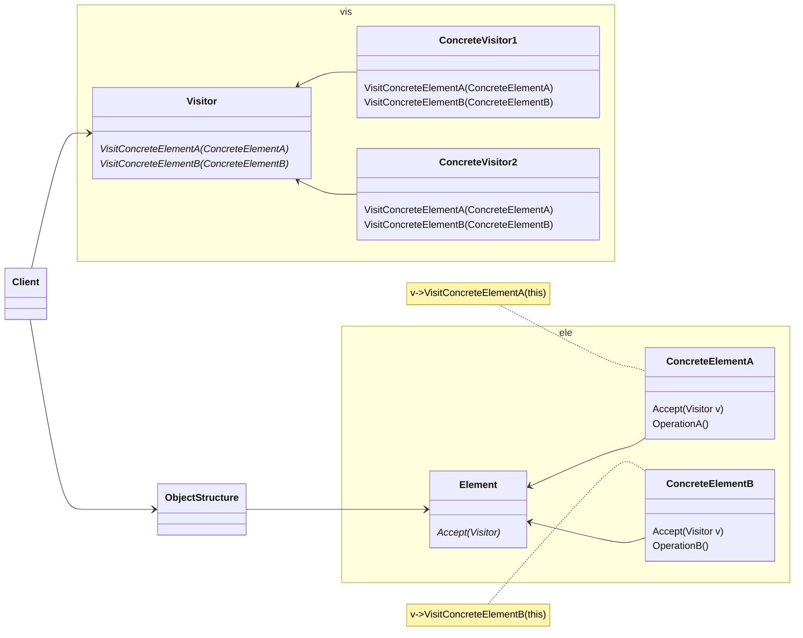

# 动机

在软件构建过程中，由于需求的改变，某些类层次结构中常常需要添加新的行为（方法），如果直接在基类中这样更改，将会给子类带来很繁重的变更负担，甚至破坏原有设计。

# 定义

表示一个作用于某对象结构中的各个元素的操作。使得可以在不改变（稳定）各元素的类的前提下定义（扩展）作用于这些元素的新操作（变化）。

# 类图




# 示例

```C++
// 注：要求所有Element的子类都是确定的
class ElementA;
class ElementB;
class Visitor{
public:
  virtual void visitElementA(ElementA& element) = 0;
  virtual void visitElementB(ElementB& element) = 0;
  virtual ~Visitor() = default;
};
class Element{
public:
  virtual void accept(Visitor& visitor) = 0;
  virtual ~Element() = default;
};
class ElementA : public Element
{
public:
  void accept(Visitor& visitor) override {
    visitor.visitElementA(*this);
  }
};
class ElementB : public Element
{
public:
  void accept(Visitor& visitor) override {
    visitor.visitElementB(*this);
  }
};
//==================================
class Visitor1: public Visitor {
public:
  void visitElementA(ElementA& element) override {
    std::cout << "Visitor1 is processing ElementA" << std::endl;
  }
  void visitElementB(ElementB& element) override {
    std::cout << "Visitor1 is processing ElementB" << std::endl;
  }
};
class Visitor2: public Visitor {
public:
  void visitElementA(ElementA& element) override {
    std::cout << "Visitor2 is processing ElementA" << std::endl;
  }
  void visitElementB(ElementB& element) override {
    std::cout << "Visitor2 is processing ElementB" << std::endl;
  }
};
int main(int argc, char** argv) {
  Visitor2 v2 = Visitor2();
  ElementB element;
  element.accept(v2);//double dispatch 二次多态辨析
  return 0;
}
```
