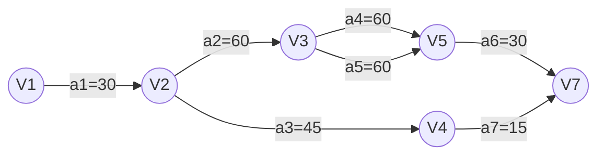

# 网络

网络（网）：带权图的一种特殊形式。由顶点和带有权值的边组成，权值通常是非负实数，用来表示距离、时间、费用等实际意义

权：边或弧上具有与之相关的数据信息，表示从一个顶点到另一个顶点的权重

活动：一个工程可划分为若干个子工程或阶段，将工程划分为若干子工程，每一个子工程就是一个活动
## 1 网的类型

有向网：带权的有向图

无向网：带权的无向图

### 1.1 AOE网

AOE网（Activity On Edges）：是一种用==边表示活动==的有向图，即网络中的每条边对应一个活动，顶点表示“事件”
- 只有在某==顶点==所代表的事件==发生后==，从该顶点出发的==各活动才能开始==
- 只有在==进入某顶点==的==各活动都结束==，该顶点所代表的==事件才能发生==

### 1.2 AOV网
AOV网（Activity On Vertices）：是一种用==顶点表示活动==的有向图，即网络中的每个顶点对应一个活动，弧，有向边表示活动之间的优先关系

## 2 网的应用

### 2.1 拓扑排序

拓扑排序：基于[[计算机/数据结构/图形结构/网#AOV网|AOV网]]选择出子工程执行顺序

拓扑排序算法的基本思想---重复选择没有直接前驱的顶点
1. 在[[计算机/数据结构/图形结构/网#AOV网|AOV网]]中选择一个没有前驱的顶点且输出
2. 在[[计算机/数据结构/图形结构/网#AOV网|AOV网]]中删除该顶点以及从该顶点出发的（以该顶点为尾的弧）所有有向弧
3. 回到1全部顶点均已输出，拓扑有序序列形成，拓扑排序完成
	- 如果图中还有未输出的顶点，这说明它们都有直接前驱，再也找不到没有前驱的顶点了，这时[[计算机/数据结构/图形结构/网#AOV网|AOV网]]中必定存在有向环

> [!warning] 注
> 在[[计算机/数据结构/图形结构/网#AOV网|AOV网]]中，不应该出现有向环，顶点的先后关系就会进入死循环。工程或系统将不能正确推进。

| 课程代号 | 课程名称     | 先修课程   |
| ---- | -------- | ------ |
| C₁   | 高等数学     |        |
| C₂   | 程序设计基础   |        |
| C₃   | 离散数学     | C₁, C₂ |
| C₄   | 数据结构     | C₃, C₂ |
| C₅   | 高级语言程序设计 | C₂     |
| C₆   | 编译原理     | C₅, C₄ |
| C₇   | 操作系统     | C₄, C₉ |
| C₈   | 普通物理     | C₁     |
| C₉   | 计算机组成原理  | C₈     |

![[计算机/数据结构/attachments/2026-02-05_195922.svg]]

其中一种情况：$C_{1}C_{2}C_{8}C_{3}C_{5}C_{9}C_{4}C_{6}C_{7}$

### 2.2 关键路径

**关键路径**：在[[计算机/数据结构/图形结构/网#AOE网|AOE网]]中，从源点到汇点据有最大路径长度的路径
- **事件**：表示之前的活动已经完成，之后的活动可以开始
- **源点**：入度为0的顶点
- **汇点**：出度为0的顶点，只有一个
- *路径长度*：路径上各个活动持续时间之和
- 关键活动：关键路径上的活动，即$l(i)==e(i)$的活动

#### 2.2.1 求解关键路径
1. 设活动 `ai`用弧 $<j,k>$表示，其持续时间记录为$W_{j,k}$

2. 从$ve(1)=0$开始向前递推
	- $ve(j)=\max_{i}\{ve(i)+W_{i,j}\},<i,j>\in T,2\leq j\leq n$
	- 其中$T$是所有以$j$为头的弧的集合
3. 从$vl(n)=ve(n)$开始后递推
	- $vl(j)=\min_{j}\{ve(i)-W_{i,j}\},<i,j>\in S,1\leq i\leq n-1$
	- 其中$S$是所有以$i$为头的弧的集合
4. 则有
	- $e(i)=ve(j)$
	- $l(i)=vl(k)-W_{j,k}$
5. 则得到关键活动$l(i)-e(i)=0$

#### 2.2.2 关键路径的讨论

- 若网中有几条关键路径，则需加快同时在几条关键路径上的关键活动。
- 如果一个活动处于所有的关键路径上，那么提高这个活动的速度，就能缩短整个工程的完成时间
- 处于所有的关键路径上的活动完成时间不能缩短太多
	- 否则会使原来的关键路径变成不是关键路径
	- 这时必须重新寻找关键路径

举行宴会问题

| 活动代码 | 活动描述  | 历时  | 前置任务  |
| ---- | ----- | --- | ----- |
| a1   | 菜单制定  | 30  |       |
| a2   | 原材料采购 | 60  | a1    |
| a3   | 餐具准备  | 45  | a1    |
| a4   | 甜点准备  | 60  | a2    |
| a5   | 原料清晰  | 60  | a2    |
| a6   | 烹饪    | 30  | a4，a5 |
| a7   | 桌椅布置  | 15  | a3    |
| a8   | 宴会开始  | 0   | a6，a7 |

| 顶点  | 事件`vj`的最早发生时间$ve(vj)$ | 事件`vj`的最迟发生时间$vl(vj)$ |
| --- | --------------------- | --------------------- |
| v1  | 0                     | 0                     |
| v2  | 30                    | 30                    |
| v3  | 90                    | 90                    |
| v4  | 75                    | 165                   |
| v5  | 150                   | 150                   |
| v7  | 180                   | 180                   |

| 活动 代码 | 活动`ai`最早 开始时间$e(i)$ | 活动`ai`最晚 开始时间$l(i)$ | 完成活动 `ai` 时间余量$l(i)-e(i)$ |
| -------- | ---------------------- | ---------------------- | ---------------------------- |
| a1       | 0                      | 0                      | 0                            |
| a2       | 30                     | 30                     | 0                            |
| a3       | 30                     | 120                    | 90                           |
| a4       | 90                     | 90                     | 0                            |
| a5       | 90                     | 90                     | 0                            |
| a6       | 150                    | 150                    | 0                            |
| a7       | 75                     | 145                    | 70                           |

- 路径为$a_{1}\to a_{2}\to a_{4}\to a_{6}$
- 或$a_{1}\to a_{2}\to a_{5}\to a_{6}$

