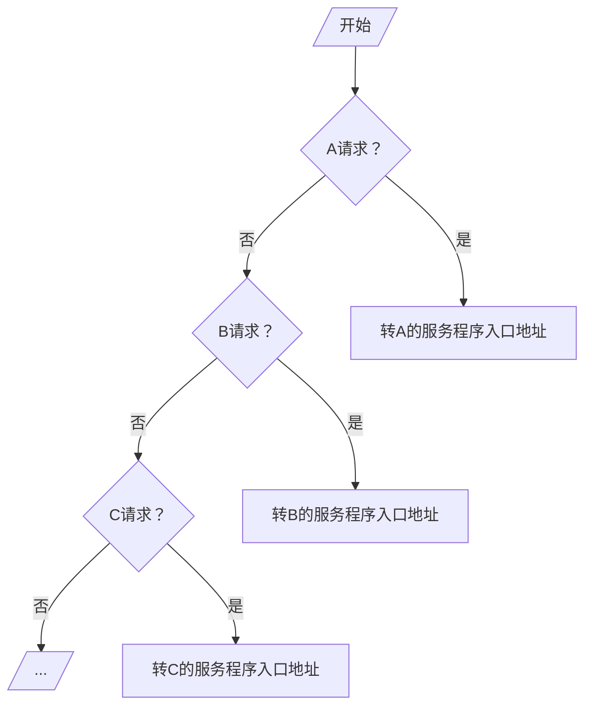
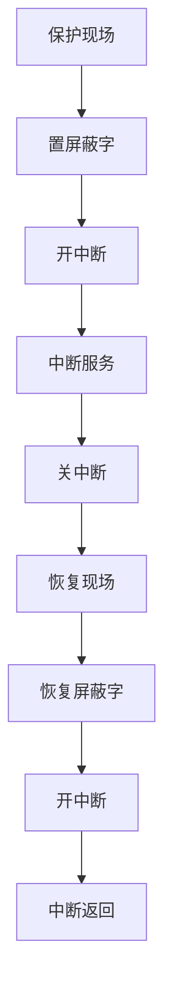

# 中断系统

**中断（外中断）**：由外部设备触发的、与当前正在执行的指令无关的异步事件
- **异常（内中断）**：CPU 内部产生的意外事件。CPU 执行一条指令时，由 CPU 在其内部检测到的、与正在执行的指令相关的同步事件

引起中断的因素

- 人为设置的中断：如转管指令
- 程序性事故：溢出、操作码不能识别、除法非法
- 硬件故障：磁盘坏道、电源掉电
- IO设备
- 外部事件：用键盘中断现行程序
- 等等

需要解决的问题

- 各中断源向CPU提出请求的方式
- 各中断源同时提出请求的顺序
- CPU响应中断的条件、时间、方式
- 保护现场的方式
- 寻找入口地址的方式
- 回复现场和返回的方式
- 处理多重中断的方式

> 解决方式：使用软件+硬件共同解决

## 中断请求标记

中断请求标记 INTR：一个中断源对应一个INTR中断请求标记触发器，多个INTR组成中断请求标记寄存器

中断请求标记可以实现的位置

- INTR分散在各个中断源的接口电路中
- INTR集中在CPU的中断系统内

## 判优逻辑

### 硬件实现（排队器）

实现方式

- 链式排队器](0203-计算机组成原理/05-输入输出设备/5.5%20程序中断方式.md#排队器)：分散在各个中断源的接口电路中
- 集中在CPU内：$INTR_1$、$INTR_2$、$INTR_3$、$INTR_4$优先级按降序排列

### 软件实现

A、B、C 优先级按降序排列

## 中断服务程序入口地址的寻找

### 硬件向量法

特点：速度快、不易更改
!0203-计算机组成原理/05-输入输出设备/5.5 程序中断方式#中断向量地址形成部件](0203-计算机组成原理/05-输入输出设备/5.5%20程序中断方式.md#中断向量地址形成部件)

### 软件查询法

- 8个中断源1-8按降序排列，使用中断识别程序（入口地址M）

## 中断响应

单重中断：当开始执行中断程序时，不能响应其他中断请求

### 响应中断的条件

- 允许中断触发器EINT=1

### 响应中断的时间

指令执行周期结束时刻由CPU发出查询信号

> 原因[指令执行周期结束]：需要保存程序断点

### 中断隐指令

隐指令：由计算机硬件完成的操作，不是CPU指令集的一部分

保护程序断点：断点保存于特点地址（0号地址）内，断点进栈

### 寻找服务程序入口地址

- 硬件向量法：`向量地址->PC`
- 软件查询法：中断识别程序入口地址`M->PC`

### 硬件关中断

作用

- 单重中断：防止其他中断请求
- 多重中断：保护程序断点

实现

- INT中断标记
- EINT允许中断

# 保护现场和恢复现场

## 保护现场

- 保护断点：中断隐指令完成
- 保护寄存器内容：中断服务程序完成

## 恢复现场

恢复现场：中断服务程序完成

> 中断服务程序
>
> - 保护现场：PUSH
> - 其他服务程序：视不同请求源而定
> - 恢复现场：POP
> - 中断返回：IRET

# 多重中断

## 多重中断的概念

多重中断：CPU在执行中断服务程序的过程中，如果产生新的优先级更高的中断源，当前中断程序会中断，而执行新的中断服务程序

程序断点 k+1，l+1，m+1

## 实现多重中断的条件

- 提前设置开中断指令
- 优先级别高的中断源有权中断优先级别低的中断源

## 屏蔽技术

### 屏蔽触发器

作用

- 控制发出中断请求
- 控制排队器选择

实现

- MASK=0（未屏蔽），INTR能被置1
- $MASK_i$=1（屏蔽），$INTP_i$=0（不能被排队器选中）

### 屏蔽字

16个中断源1-16按降序排列

| 优先级 | 屏蔽字              |
| ------ | ------------------- |
| 1      | 1111 1111 1111 1111 |
| 2      | 0111 1111 1111 1111 |
| 3      | 0011 1111 1111 1111 |
| 4      | 0001 1111 1111 1111 |
| 5      | 0000 1111 1111 1111 |
| 6      | 0000 0111 1111 1111 |
| 7      | 0000 0011 1111 1111 |
| 8      | 0000 0001 1111 1111 |
| 9      | 0000 0000 1111 1111 |
| 10     | 0000 0000 0111 1111 |
| 11     | 0000 0000 0011 1111 |
| 12     | 0000 0000 0001 1111 |
| 13     | 0000 0000 0000 1111 |
| 14     | 0000 0000 0000 0111 |
| 15     | 0000 0000 0000 0011 |
| 16     | 0000 0000 0000 0001 |

### 屏蔽技术可改变处理优先等级

- 响应优先级：不可改变
- 处理优先级：可改变（通过重新设置屏蔽字）

| 中断源 | 原屏蔽字 | 新屏蔽字 |
| ------ | -------- | -------- |
| A      | 1111     | 1111     |
| B      | 0111     | 0100     |
| C      | 0011     | 0110     |
| D      | 0001     | 0111     |

- 响应优先级：A->B->C->D降序排列
- 处理优先级：A->D->C->B降序排列

### 屏蔽技术可改变处理优先级
CPU执行程序轨迹（原屏蔽字）

CPU执行程序轨迹（新屏蔽字）

中断处理优先级为ADCB

### 屏蔽技术的其他作用
可以人为屏蔽某个中断源的请求

### 新屏蔽字的设置
中断服务程序完整流程

## 多重中断的断点保护

- 断点进栈：中断隐指令完成
- 断点存入“0”地址：中断隐指令完成

中断周期
- 0->MAR
- 命令存储器写
- PC->MDR 断点->MDR
- (MDR)->存入存储器

三次中断，则三个断点都存入“0”地址

### 程序断点存入“0”地址的断点保护

| 地址   | 内容          | 说明                   |
| ------ | ------------- | ---------------------- |
| 0      | xxxx          | 存程序断点             |
| 5      | `JMP SERVE`   | 5为向量地址            |
| SERVE  | `STA SAVE`    | 保护现场               |
|        | 。。。        |                        |
|        | `LDA 0`       | 0地址内容转存          |
|        | `STA RETURN`  | 0地址内容转存          |
|        | `ENI`         | 置屏蔽字后，开中断     |
|        | 。。。        | 其他服务内容           |
|        | `LDA SAVE`    | 恢复现场               |
|        | `JMP @RETURN` | 恢复屏蔽字后，间址寻址 |
| SAVE   | xxxx          | 存放ACC内容            |
| RETURN | xxxx          | 转存0地址内容          |
