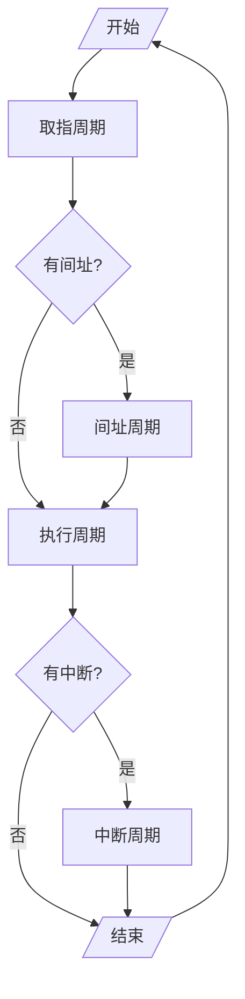

# 指令周期

指令周期：取出并执行一条指令所需的全部时间
- 一条指令：取指周期（取指、分析）、执行（执行）

![[Pasted image 20240304074304.png]]

每条指令的指令周期不同
- 取值周期就是指令周期，例如 `NOP`
- 取指周期与执行周期一样长，例如 `ADD mem`
- 取指周期与执行周期不同，例如 `MUL mem`

## [[计算机科学/组成原理/_old/7 指令系统/7.3 寻址方式.md#间接寻址|具有间接寻址]]的指令周期

## 具有中断周期的指令周期

## 指令周期的流程

## CPU 工作周期的标志

CPU 访存有四种性质

- *取*指令：取值周期
- *取*地址：间址周期
- *存取*操作结果：执行周期
- *存*程序断点：中断周期

控制当前状态

# 指令周期的数据流

## 取指周期数据流

- `PC->MAR->地址总线->M`
- `CU[r]->控制总线->M`
- `M->数据总线->MDR->IR`
- `CU[+1]->PC`

## 间址周期的数据流

- `MDR[A]->MAR->地址总线->M`
- `CU[r]-->控制总线->M`
- `M->数据总线->MDR`

## 执行周期的数据流

> 不同指令的执行周期数据流不同

## 中断周期的数据流

- 保存程序断点
	- `CU->MAR->dzzx->M`
	- `PC->MDR->sjzx->M`
	- `CU[w]->kzzx->M`
- [形成中断程序入口地址](计算机科学/组成原理/_old/8%20CPU的结构和功能/8.4%20中断系统.md)
	- `CU[中断程序入口地址]->PC`

## 指令周期

- *非访存*指令周期 
- *直接访存*指令周期 
- *间接访存*指令周期 
- *转移*指令周期 
- *间接转移*周期 

### 取指周期

- $PC\to MAR\to 地址总线$
- $CU[1]\to R$
- $M[MAR]\to MDR$
- $MDR\to IR$
- $IR[OP]\to CU$
- $(PC)+1\to PC$

### 间址周期

- $指令形式地址\to MAR$
- $IR[Ad]\to MAR$
- $CU[1]\to R$
- $M[MAR]\to 数据总线\to MDR$
- $MDR\to IR[Ad]$

### 执行周期

#### 非访存指令

- `CLA;`：清 0 $CU[0]\to ACC$
- `COM`：取反 $\overline{ACC}\to ACC$
- `SHR`：算数右移
  - $ACC[Left]\to ACC[Right]$
  - $ACC_0\to ACC_0$
- `CLS`：循环左移
  - $ACC[Right]\to ACC[Left]$
  - $ACC_0\to ACC_n$
- `STP`：停机标志 $CU[0]\to G$

#### 访存指令

- `ADD X`：加法指令
  - $IR[Ad]\to MAR$
  - $CU[1]\to R$
  - $M[MAR]\to MDR$
  - $ACC+MDR\to ACC$
- `STA X`：存数指令
  - $IR[Ad]\to MAR$
  - $CU[1]\to W$
  - $ACC\to MDR$
  - $MDR\to M[MAR]$
- `LDA X`：取数指令
  - $IR[Ad]\to MAR$
  - $CU[1]\to R$
  - $M[MAR]\to MDR$
  - $MDR\to ACC$

### 转移指令

无条件转移
- `JMP X`：直接转移 $IR[Ad]\to PC$

有条件转移
- `BAN X`：负数则转移 $ACC_0\cdot IR[Ad]+\overline{ACC_0}\cdot (PC)\to PC$

### 中断周期

程序断点存入*“0”地址*

- $CU[0]\to MAR$
- $CU[1]\to W$
- $PC\to MDR$
- $MDR\to M[MAR]$
- $向量地址\to PC$ (或 $中断识别程序入口地址M\to PC$)
- $CU[0]\to EINT$

程序断点*进栈*

- $(SP)-1\to MAR$
- $CU[1]\to W$
- $PC\to MDR$
- $MDR\to M[MAR]$
- $向量地址\to PC$ (或 $中断识别程序入口地址M\to PC$)
- $CU[0]\to EINT$
