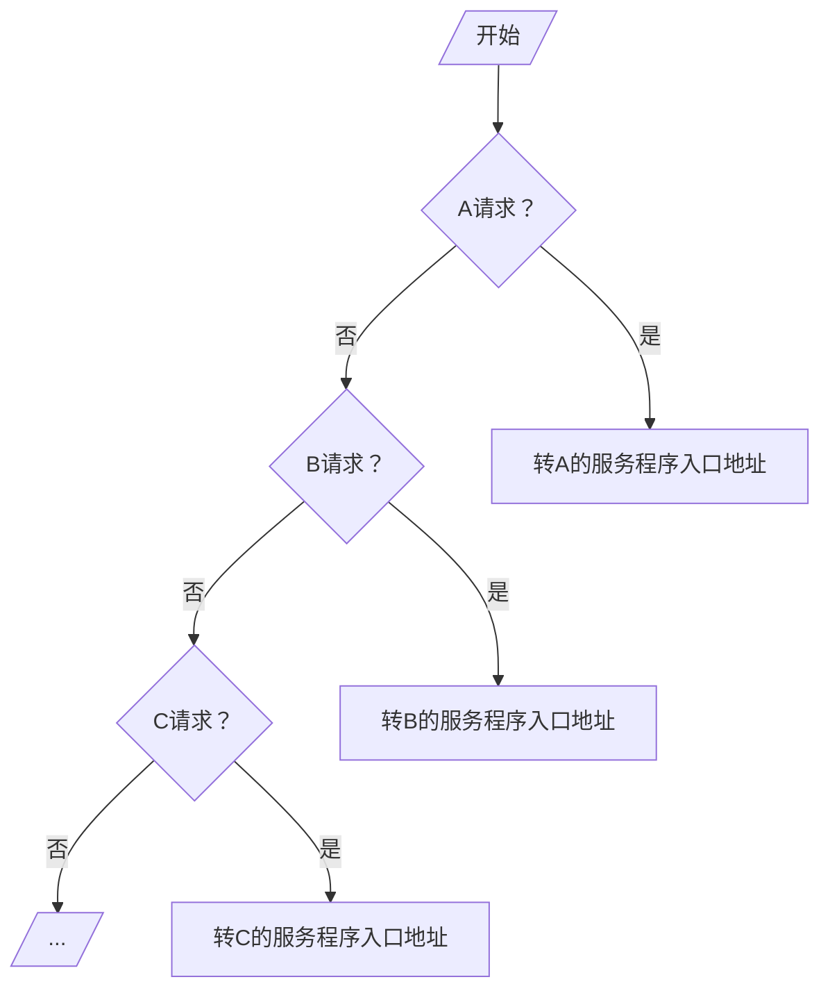

# 中断

**中断**：CPU 在执行程序的过程中，如果发生意外事件或者特殊事件，CPU 要中断当前程序的处理或运行，而处理事件程序，结束时间程序后恢复到原程序断点处继续执行原程序

## 分类

### 根据是否跟当前指令相关

**外中断**：由外部设备触发的、与当前正在执行的指令无关的异步事件
- 外设中断
- 时钟中断

**内中断**：CPU 内部产生的意外事件。CPU 执行一条指令时，由 CPU 在其内部检测到的、与正在执行的指令相关的同步事件
- 故障
	- 非法操作码
	- 除数为 0
	- 缺页缺段
	- 计算溢出
- 自陷
	- 设置断点
- 终止
	- 控制器出错
	- 存储器校验错

### 根据中断产生位置

内部

## 中断源

中断源：能产生中断信号的设备

- 人为设置的中断：如转管指令![[Pasted image 20240305152302.png]]
- 程序性事故：溢出、操作码不能识别、除法非法
- 硬件故障：磁盘坏道、电源掉电
- IO设备
- 外部事件：用键盘中断现行程序
- 等等

需要解决的问题

- 各中断源向CPU提出请求的方式
- 各中断源同时提出请求的顺序
- CPU响应中断的条件、时间、方式
- 保护现场的方式
- 寻找入口地址的方式
- 回复现场和返回的方式
- 处理多重中断的方式

> 解决方式：使用软件+硬件共同解决

## 判优逻辑

### 硬件实现（排队器）

实现方式

- 链式排队器：分散在各个中断源的接口电路中
- 集中在CPU内：$INTR_1$、$INTR_2$、$INTR_3$、$INTR_4$优先级按降序排列

### 软件实现

A、B、C 优先级按降序排列

