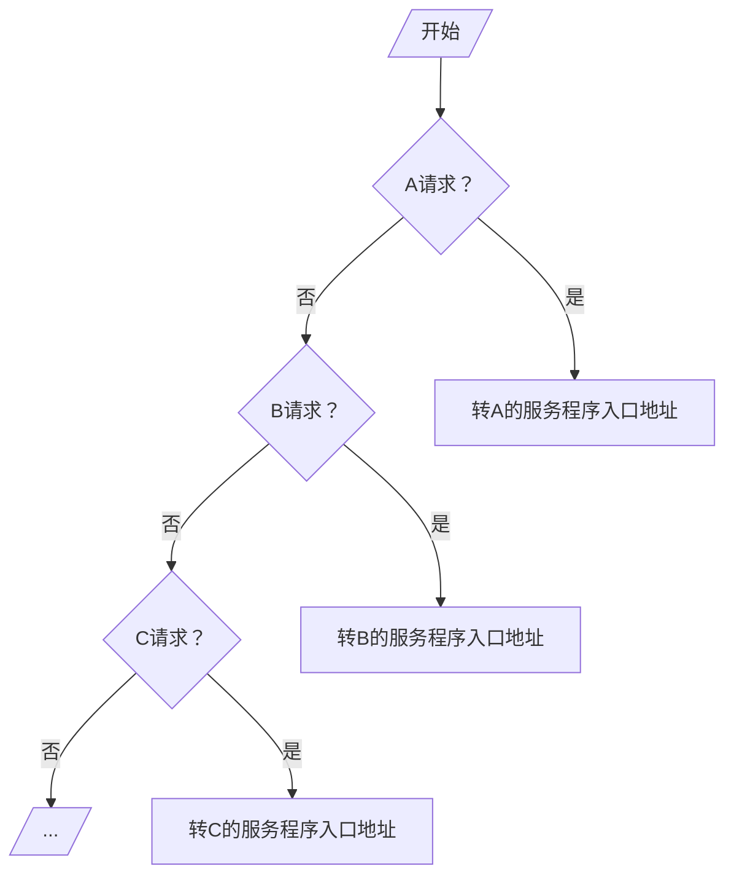

## 中断判优

- 硬件：在 cpu 内或接口电路中（链式排队器）
	- 设备 $1^\#$、$2^\#$、$3^\#$、$4^\#$ 优先级按照降序排列
	- $INTR_i=1$ 有请求，即 $\overline{INTR_i}$
- 软件：优先级按降序排列

### 排队器

排队器：当同时有多个中断源产生中断信号，检测优先级最高的中断源，高电平只有一位
- 链式排队器：分散在各个中断源的接口电路中
- 集中在 CPU 内：$INTR_1$、$INTR_2$、$INTR_3$、$INTR_4$ 优先级按降序排列 

### 软件实现

A、B、C 优先级按降序排列

