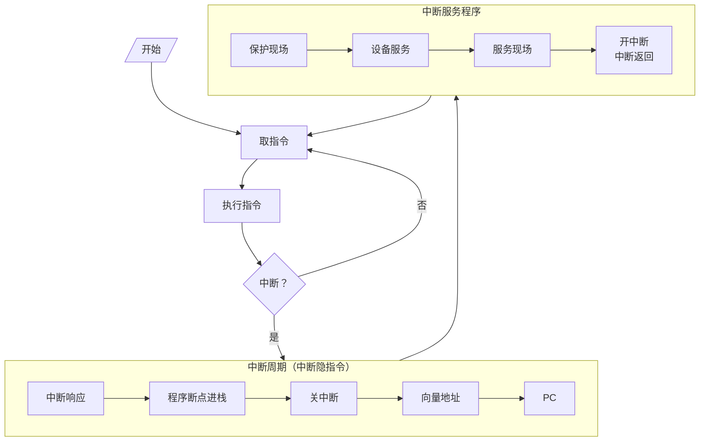
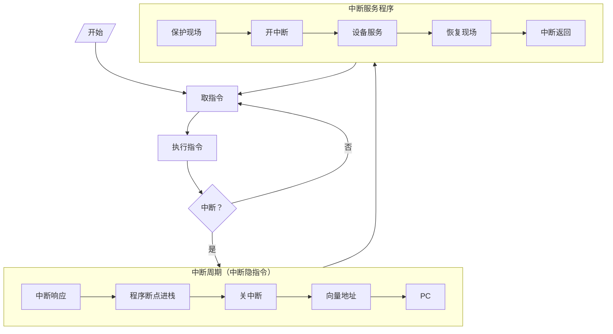

# 中断服务程序

中断服务程序：处理中断的程序
- 中断向量：中断服务程序的入口地址
- 中断向量地址：

## 功能

- 保护现场：PUSH
- 其他服务程序：视不同请求源而定
- 恢复现场：POP
- 中断返回：IRET

### 保护现场

- 程序断点的保护：中断隐指令完成
- 寄存器内容的保存：进栈指令，中断服务程序完成

### 中断服务

- 对不同的 IO 设备具有不同内容的设备服务

### 恢复现场

将保存的数据恢复

### 中断返回

中断返回指令

## 入口地址

- 硬件向量法：由硬件产生向量地址，再由向量地址找到入口地址
	- 类似设备编码器
- 由软件产生

### 中断向量地址形成部件

中断向量地址形成部件：用于锁定产生中断信号的中断源的位置
- 特点：速度快、不易更改

- 向量地址：12 H、13 H、14 H
- 入口地址：200、300、400

### 软件查询法

- 8个中断源1-8按降序排列，使用中断识别程序（入口地址M）

## 单重与多重中断流程
### 单重中断服务程序流程

### 多重中断服务程序流程

## 主程序和服务程序抢占 CPU 示意图

- 宏观上 CPU 和 IO 并行工作
- 微观上 CPU 中断现行程序为 IO 服务
