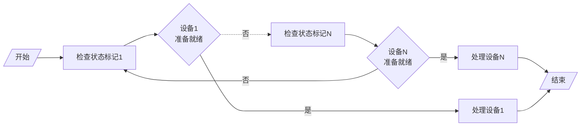
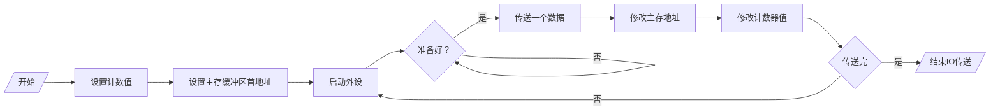

# 程序查询方式

程序查询方式：
- 特点：CPU 有踏步等待现象，CPU 在探询(查询)阶段，不能做别的事情，一直忙于查询，导致不能响应别的事情。
- 外设与 CPU 串行执行

## 查询流程

- 检查状态标记：测试指令
- 准备就绪：转移指令
- 数据交换：传送指令

## 程序流程

1. CPU 执行初始化程序，并预置传输参数
2. 发命令：向 IO 接口发出命令字启动 IO 设备
3. 读取状态：CPU 从外设接口读取状态信息，不断查询 IO 设备状态，直到外设准备就绪
4. 传送一次数据
5. 修改地址和计数器参数

保存寄存器内容

## 程序查询方式接口电路

以输入为例

1. CPU 通过地址线给出外部设备的地址
2. 设备选择电路与地址线上的地址进行比较
3. SEL（选择设备）信号与启动命令信号有效
4. 将标志 D（设备准备标志）置为 0
5. 将标志 B（设备忙标志）置为 1，并启动设备
6. 设备将准备好的数据保存到 DBR（数据缓冲区）中
7. 设备工作结束，发出结束信号
8. 将标志 B（设备忙标志）置为 0
9. 将标志 D（设备准备标志）置为 1，向 CPU 发出准备就绪信号

> 在整个过程中，CPU 在原地踏步对 D 为 1 进行查询

## 踏步现象

踏步现象：在外设准备数据的过程中，CPU 停止现行程序的运行，并在现行程序中插入一段探询程序

![[Pasted image 20260507202539.png]]