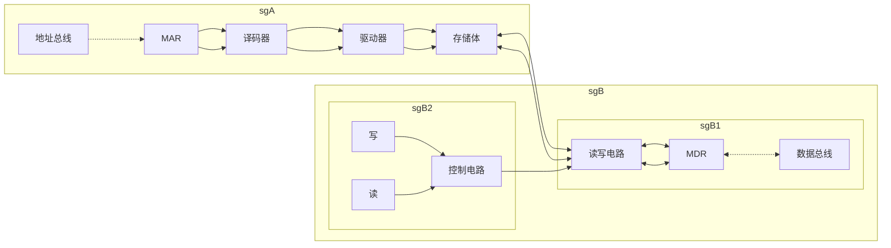
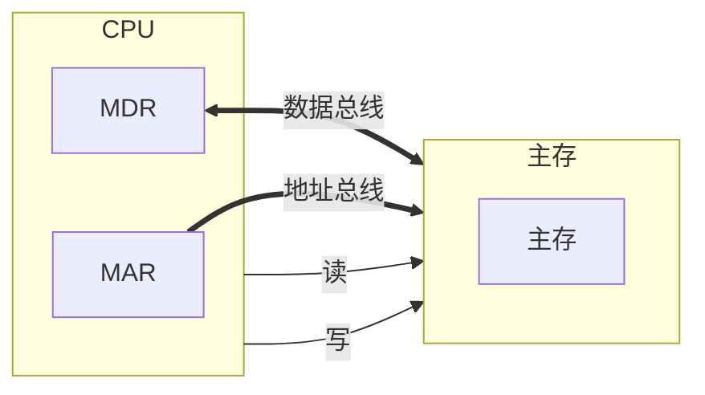

# 主存储器–概述

## 主存的基本组成

## 主存与CPU之间的联系

## 主存中存储单元地址的分配

假设 存储字长32位，每字节存一个地址
问 数据`12345678H`如何在主存储器中进行存储
设地址线`24`根 按***字节***寻址$2^24=16MB$若字长为`16`位 按***字***寻址$8MW$若字长为`32`位 按***字***寻址$4MW$

### ***高位地址***为字地址

| 字地址 |  字  |  节  |  地  |  址  |
| ------ | --- | --- | --- | --- |
| 0      | 12  | 34  | 56  | 78  |
| 4      |     |     |     |     |
| 8      |     |     |     |     |

- 将高位字节 存放在低位地址

- 并将高位字节所在地址设置为字地址

- 大段、大尾方式

### **低位字节**地址为字地址

| 字地址 |  字  |  节  |  地  |  址  |
| ------ | --- | --- | --- | --- |
| 0      | 78  | 56  | 34  | 78  |
| 4      |     |     |     |     |
| 8      |     |     |     |     |

- 将低位存放在低地址
- 低位所在地址为字地址
- 小端、小尾方式

## 主存的技术指标

存储容量：主存存放二进制代码的总位数
存储速度
存取时间：存储器的访问时间
读出时间/写入时间
存取周期：连续两次独立的存储器操作（读写）所需的最小间隔时间
读周期/写周期

> 思考：存储周期长于存取时间的原因是由于存取周期会包括寻址时间
存储器的带宽 单位时间内可以操作的位数
单位：位/秒

# 半导体存储芯片简介

## 基本结构

![[2026-03-14_213316.svg]]

### 芯片容量的计算

$芯片容量(bit)=2^{地址线数}×数据线数$

| 地址线(单向) | 数据线（双向） | 芯片容量  |
| ----------- | ------------- | -------- |
| 10          | 4             | $1K×4b$  |
| 14          | 1             | $16K×1b$ |
| 13          | 8             | $8K×8b$  |

### 信号线

片选线：芯片选择线

- $\overline{CS}$：芯片选择信号，低电平有效

- $\overline{CE}$：芯片使能信号

读写控制线：控制芯片读写

- $\overline{WE}$：低电平写高电平读

- $\overline{OE}$：允许读 | $\overline{WE}$：允许写

### 片选线的作用

假如 用$16K×1b$的存储芯片组成$64Kx8b$的存储器
问 应该如何构成？

1. 将八个存储芯片组成一组
2. 用4组组成存储器
3. 当地址信号为65535=64K-1时，第4组的片选有效
4. 8个芯片同时读出一位，满足读取要求

