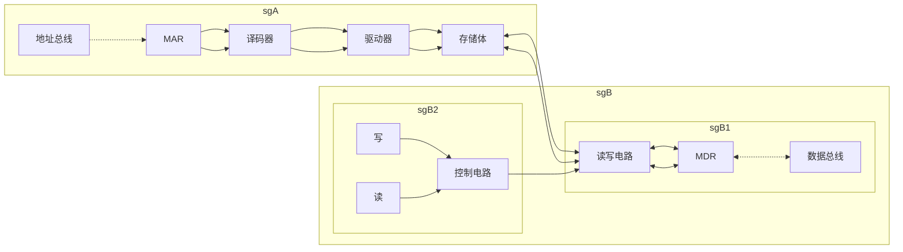
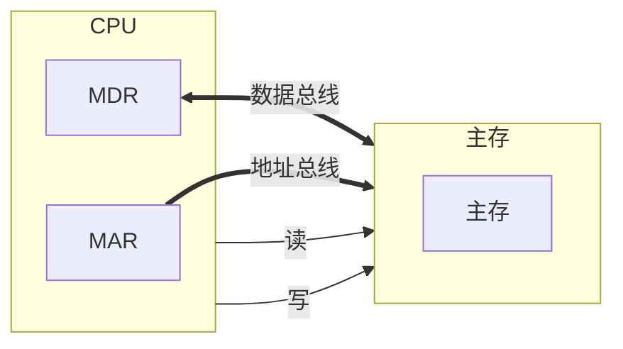

# 主存储器–概述

## 主存的基本组成

## 主存与CPU之间的联系

## 主存中存储单元地址的分配

假设 存储字长32位，每字节存一个地址
问 数据`12345678H`如何在主存储器中进行存储
设地址线`24`根 按***字节***寻址 $2^24=16MB
$若字长为`16`位 按***字***寻址 $8MW
$若字长为`32`位 按***字***寻址 $4MW$

### ***高位地址***为字地址

| 字地址 |  字  |  节  |  地  |  址  |
| ------ | --- | --- | --- | --- |
| 0      | 12  | 34  | 56  | 78  |
| 4      |     |     |     |     |
| 8      |     |     |     |     |

- 将高位字节 存放在低位地址

- 并将高位字节所在地址设置为字地址

- 大段、大尾方式

### **低位字节**地址为字地址

| 字地址 |  字  |  节  |  地  |  址  |
| ------ | --- | --- | --- | --- |
| 0      | 78  | 56  | 34  | 78  |
| 4      |     |     |     |     |
| 8      |     |     |     |     |

- 将低位存放在低地址

- 低位所在地址为字地址

- 小端、小尾方式

## 主存的技术指标

存储容量：主存存放二进制代码的总位数
存储速度
存取时间：存储器的访问时间
读出时间/写入时间
存取周期：连续两次独立的存储器操作（读写）所需的最小间隔时间
读周期/写周期

> 思考：存储周期长于存取时间的原因是由于存取周期会包括寻址时间
存储器的带宽 单位时间内可以操作的位数
单位：位/秒

# 半导体存储芯片简介

## 基本结构

![[2026-03-14_213316.svg]]

### 芯片容量的计算

$芯片容量(bit)=2^{地址线数}×数据线数$

| 地址线(单向) | 数据线（双向） | 芯片容量  |
| ----------- | ------------- | -------- |
| 10          | 4             | $1K×4b$  |
| 14          | 1             | $16K×1b$ |
| 13          | 8             | $8K×8b$  |

### 信号线

片选线：芯片选择线

- $\overline{CS}$：芯片选择信号，低电平有效

- $\overline{CE}$：芯片使能信号

读写控制线：控制芯片读写

- $\overline{WE}$：低电平写高电平读

- $\overline{OE}$：允许读 | $\overline{WE}$：允许写

### 片选线的作用

假如 用$16K×1b$的存储芯片组成$64Kx8b$的存储器
问 应该如何构成？

1. 将八个存储芯片组成一组
2. 用4组组成存储器
3. 当地址信号为65535=64K-1时，第4组的片选有效
4. 8个芯片同时读出一位，满足读取要求

# 存储器的校验
由于环境当中的电磁干扰，可能对存储单元所存储的信息造成干涉，导致数据失效。

- 合法代码集合

    1. 普通存储 {000, 001, 010, 011, 100, 101, 110, 111} 检错0位、纠错0位
    2. 奇偶存储 {000, 011, 101, 110} 检错1位、纠错0位
    3. 三倍冗余 {000, 111}  检错1位、纠错1位
    4. 四倍冗余 {0000, 1111} 检错2位、纠错1位
    5. 五倍冗余 {00000, 11111} 检错2位、纠错2位

> 编码的检测能力和纠错能力与任意两组合法代码之间**二进制位**的**最少差异数**有关。

## 编码的最小距离

任意两组合法代码之间***二进制位***的***最少差异***

***编码的纠错检错能力与编码的最小距离有关***

$L-1=D+C(D≥C)$

- $L$：编码的最小距离

- $D$：检错的位数

- $C$：纠错的位数。 

## 汉明码的组成

### 汉明码

- 汉明码采用奇偶校验

- 汉明码采用分组校验

    > 分组校验：按照特定规则进行分组，并在规则内添加一位校验位

- 汉明码的分组是一种非划分方式（组和组之间存在交叉）

    - 校验位放置于$2^n$的位置

### 汉明码的组成

汉明码的三要素

- 汉明码的组成需添加：$2^k≥n+k+1$位检测

- 检测位的位置：$2^i(i=0, 1, 2, ...)$

- 检测位的取值：检测位的取值与该位所在的检测小组承担的奇偶校验任务有关。 

各检测为$C_i$所承担的检测小组

| 检测位   | 组编号   | 包含位置 |
| ----- | ----- | --------------------------------------------------------------------------------------- |
| $C_1$ | $g_1$ | $01_{0001}, 03_{0011}, 05_{0101}, 07_{0111}, 09_{1001}, 11_{1011}, 13_{1101}, 15_{1111}$|
|$C_2$|$g_2$|$02_{0010}, 03_{0011}, 06_{0110}, 07_{0111}, 10_{1010}, 11_{1011}, 14_{1110}, 15_{1111}$|
|$C_4$|$g_3$|$04_{0100}, 05_{0101}, 06_{0110}, 07_{0111}, 12_{1100}, 13_{1101}, 14_{1110}, 15_{1111}$|
|$C_8$|$g_4$|$08_{1000}, 09_{1001}, 10_{1010}, 11_{1011}, 12_{1100}, 13_{1101}, 14_{1110}, 15_{1111}$|

$g_i$小组独占$2^{i-1}$位

$g_i$和$g_j$小组共占第$2^{i-1}+2^{j-1}$位

$g_i$、$g_j$和$g_l$小组共占第$2^{i-1}+2^{j-1}+2^{l-1}$位

#### 例如

求0101按“偶校验”配置的汉明码

因为 n=4

根据 $2^k≥n+k+1$

得到 $k=3$

汉明码的排序如下

|二进制序号|1|2|3|4|5|6|7|
|-|-|-|-|-|-|-|-|
|名称|$C_1$|$C_2$|0|$C_4$|1|0|1|
|汉明码|0|1|0|0|1|0|1|

### 汉明码的纠错过程

形成新的检测位$P_i$，其位数与增添的检测位有关，如增添3位(k=3)，新的检测位为$P_4P_2P_1$。

假如 k=3，数据为0011，偶编码汉明码为1000011，错误数据90%为一个，$P_i$的取值为

- $P_1=1\oplus3\oplus5\oplus7=1\oplus0\oplus0\oplus1=0$

- $P_2=2\oplus3\oplus6\oplus7=0\oplus0\oplus1\oplus1=0$

- $P_4=4\oplus5\oplus6\oplus7=0\oplus0\oplus1\oplus1=0$

若结果都为0，数据无措，若结果为1，则数据在$P_4P_2P_1$的位置出错

> 汉明码编码的最小距离：$L=D(2)+C(0)+1=3$

