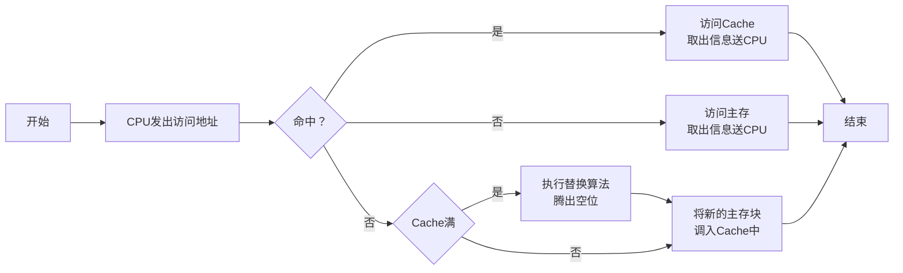

# 概述

## Cache的重要性

## Cache的工作原理

## Cache的基本结构

## Cache的读写操作

### 读

### 写

Cache和主存的一致性

- 写直达法（Write-through）：写操作时数据既写入cache又写入主存，**写操作时间就是访问主存的时间**，Cache块退出时，不需要对主存执行写操作，更新策略比较容易实现。

- 写回法（Write-back）：写操作时只把数据写入cache而不写入主存，当cache数据被替换出去时才写回主存，**写操作时间就是访问cache的时间**，cache块退出时，被替换的库尔需要写回主存，增加了cache的复杂性。

## Cache的改进

增加Cache的级数

片载（片内）Cache

片外Cache

统一缓存和分立缓存

指令Cache 数据Cache

与指令执行的控制方式有关

|类型|指令Cache|数据Cache|
|-|-|-|
|Pentium|8K|8K|
|PowerPC620|32K|32K|

# Cache-主存的地址映射

## 直接映射

每个缓存块i可以和若干个主存块对应。

每个主存块j只能和一个缓存块对应。

特点

- 速度快、结构简单

- Cache的利用率低

## 全相联映射

主存任何块可以放置到Cache任何位置

特点

- 速度慢、结构复杂

- 标记较长

- 效率利用率高

## 组相联映射

$i=j \bmod Q$

**某一主存块j**按模**Q**映射到**缓存**的第**i组**中的**任何一块**

特点：平衡全相联和直接相连的特点

# 替换算法

- 先进先出（FIFO）算法

- 近期最少使用（LRU）算法

