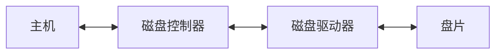

# 辅助存储器

不直接与CPU交换信息

## 磁表面存储器的技术指标

记录密度
- 磁道密度 $D_t$
- 位密度 $D_b$

存储容量：$C=n\times k \times s$
- 柱面数
- 磁道数
- 扇区数

平均寻址时间：寻道时间+等待时间+数据读取时间
- 辅存的速度（寻址速度、磁头读写时间）

数据传输率：*$D r=D_b\times V$*
- 转数
- 磁道容量：

误码率：出错信息位数与读出信息的中位数的比值

磁记录的原理和记录方式

| 写                                           | 读                                            |
| ------------------------------------------- | -------------------------------------------- |
|  |  |

## 硬磁盘存储器

硬磁盘存储器类型：固定磁头和移动磁头、可换盘和固定盘

硬磁盘存储器结构

### 磁盘驱动器

### 磁盘控制器

- 接收主机发来的命令，转换成磁盘驱动器的控制命令

- 实现主机和驱动器之间的数据格式交换

- 控制磁盘驱动器读写

  - 磁盘驱动器是主机与磁盘驱动器之间的接口（对主机-通过总线、对磁盘）

### 盘片

盘片：通常是硬质铝合金结构

## 软盘存储器

| 比较量 | 硬盘           | 软盘       |
| --- | ------------ | -------- |
| 速度  | 高            | 低        |
| 磁头  | 固定、活动、浮动     | 活动、接触、盘片 |
| 盘片  | 固定盘、盘组大部分不可换 | 可换盘片     |
| 价格  | 高            | 低        |
| 环境  | 苛刻           |          |

### 软盘片

## 光盘存储器

**光盘存储器**：采取光存储技术，利用激光写入读出
- 第一代光存储技术：采用非磁性介质，不可擦写
- 第二代光存储技术：采用磁性介质，可擦写

光盘的存储原理

- 只读型和只写一次型：热作用（物理或化学）
- 可擦写型：热磁效应

## 磁盘阵列

RAID 0

## 固态硬盘

固态硬盘

