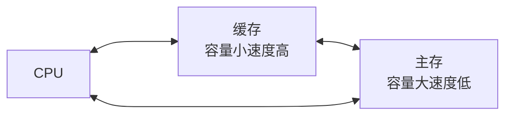

# 高速缓冲存储器

```mermaid
graph LR
  A[CPU]
  B[缓存\n容量小速度高]
  C[主存\n容量大速度低]
  A <--->B<-->C
  C<-->A
```

高速缓冲存储器 Cache：用于避免 CPU 空等现象，CPU 和主存（DRAM）的速度差异。

- 块：根据程序访问的局部性原理，Cache 和主存的单位

程序访问的局部性原理

- 时间局部性：当前正在使用的指令和数据将来还会使用到
- 空间局部性：当前正在使用的指令和数据周围的数据肯能会用到

