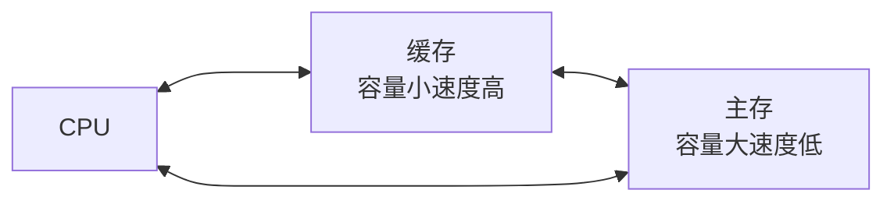
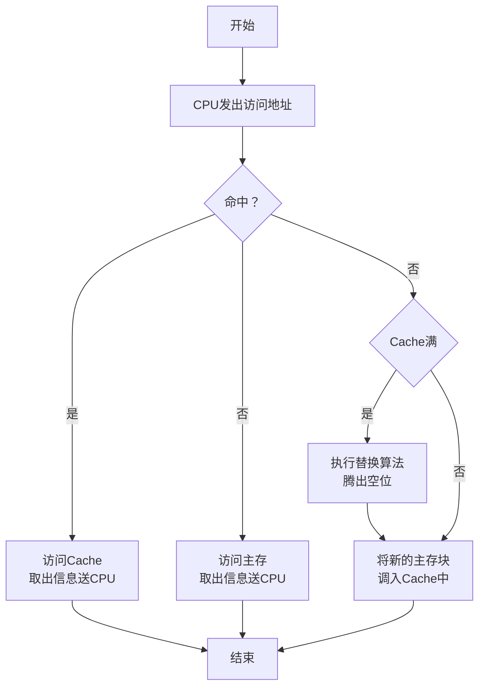

# 高速缓冲存储器

高速缓冲存储器 Cache：用于避免 CPU 空等现象，CPU 和主存（DRAM）的速度差异。

- 块：根据程序访问的局部性原理，Cache 和主存的单位

程序访问的局部性原理

- 时间局部性：当前正在使用的指令和数据将来还会使用到
- 空间局部性：当前正在使用的指令和数据周围的数据肯能会用到

## 运行原理

### 主存和缓存的编址

![[2026-03-18_185725.svg]]

主存和缓存的编址：将主存和 Cache 分成大小相等的块，主存有 M 个块，Cache 中有 C 个块，$M>>C$，CPU 给出的地址包括**块号**和**块内偏移地址**
- 块号：缓存块和内存块是完全复制关系，因此转移的缓存块号与内存块号一致
- 块内地址：决定块的大小，内存块与 Cache 块大小相同，Cache 块会有一个标记，用于判断块是否在 Cache 中

### 命中与未命中

**命中**：缓存共 C 块，主存有 M 块 $M>>C$， 主存块**调入**缓存，主存会与缓存会**建立**了对应关系
- **标记记录**：与某缓存块建立了对应关系的**主存块号**。
- **未命中**：主存块**未调入**缓存，主存块与缓存块**未建立**对应关系

### Cache 的命中率

Cache 的命中率：CPU 欲访问的信息在 Cache 中的**比率**，与 Cache 的**容量（正相关）** 与 **块长（负相关）**有关
- 块长：取一个存取周期内从主存调出的信息长度

|体系|交叉体数量|块长|
|-|-|-|
|CRAY_1|16 体|16 字|
|IBM 370/168|4 体|4 字|

### Cache-主存系统的效率

Cache-主存系统的效率：效率 $e$ 与命中率有关
- $e=\frac{访问Cache的时间}{平均访问时间}\times 100\%$

设 Cache 命中率为 h，访问 Cache 的时间为 $t_c$，访问主存的时间为 $t_m$
- 则 $e=\frac{t_c}{h\times t_c + (1-h)\times t_m}\times 100\%$

> [!warning] 注意：访问内存和访问 Cache 是在同时发生的

## Cache 的基本结构

- 主存 Cache 地址映射变换机构：将主存块号转换为可能的 Cache 块号
- Cache 替换机构：当 Cache 已满时，用于控制是否将 Cache 块替换为主存块数据

## Cache 的读写操作

### 读

### 写

Cache 和主存的一致性

- 写直达法（Write-through）：写操作时数据既写入 cache 又写入主存，**写操作时间就是访问主存的时间**，Cache 块退出时，不需要对主存执行写操作，更新策略比较容易实现。

- 写回法（Write-back）：写操作时只把数据写入 cache 而不写入主存，当 cache 数据被替换出去时才写回主存，**写操作时间就是访问 cache 的时间**，cache 块退出时，被替换的库尔需要写回主存，增加了 cache 的复杂性。

