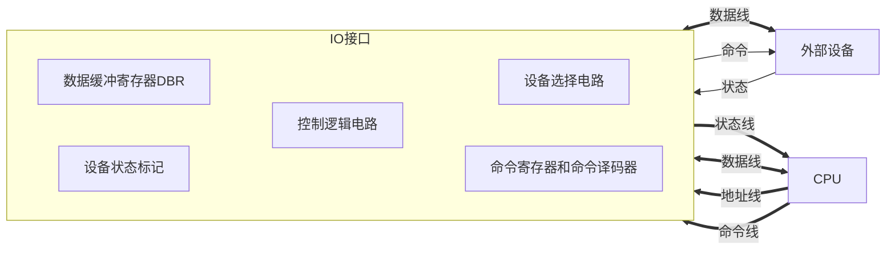

# 概述

- 实现设备的选择

- 实现数据缓冲达到数据匹配

- 实现数据串--并格式转换

- 实现点评转换

- 传送控制命令

- 反应设备状态（忙、就绪、中断请求）

# 接口的功能和组成

## 总线连接方式的IO接口电路

- 设备选择线：单向、设备地址（接口地址）

- 数据线：双向、数据的输入输出

- 命令线：单向、CPU向设备发出的指令

- 状态线：单向、设备状态

> 思考：在5.1中，IO接口与CPU的连接方式有分散连接和总线连接两种方式

## 接口的功能和组成

|功能|组成|
|-|-|
|选址功能|设备选择电路|
|传送命令功能|命令寄存器、命令译码器|
|传送数据功能|数据缓冲寄存器|
|反应设备状态功能|设备状态标记|

设备状态

- 完成触发器 D

- 工作触发器 B

- 中断请求触发器 INTR

- 屏蔽触发器MASK

## IO接口的基本组成

# 接口类型

- 按数据传送方式分类

  - 并行接口：Intel8255

  - 串行接口：Intel8251

- 按功能选择的灵活性

  - 可编程接口：Intel8255、Intel8251

  - 不可编程接口：Intel8212

- 按通用性分类

  - 通用接口：Intel8255、Intel8251

  - 专用接口：Intel8279、Intel8275

- 按照数据传送的控制方式分类

  - 中断接口：Intel8259

  - DMA接口：Intel8257
