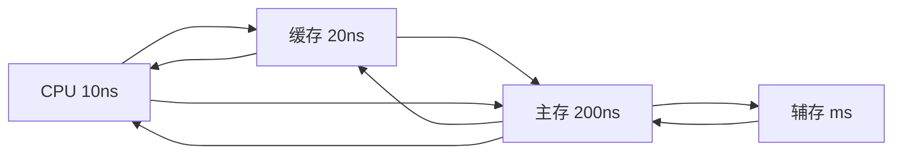

存储器可分为哪些类型
现代存储器的层次结构，为什么要分层？

# 存储器的层次结构

## 存储器主要特性的关系

### 计算机存储体系图

![[计算机科学/计算机组成原理/attachments/4.1image.png]]

### 存储体系

**存储体系**：把两种或两种以上构成的存储器，用软件、硬件、软硬件相结合的方式，连接为一个整体，从某一级的程序员来看，拥有高速度，大容量，低价格的特性，也即是透明的。

## 缓存-主存层次和主存-缓存层次

- 缓存-主存：解决速度差异
- 主存-辅存：解决存储容量
- 主存储器：实地址/物理地址
- 虚拟存储器：虚地址/逻辑地址

程序的局部性原理

