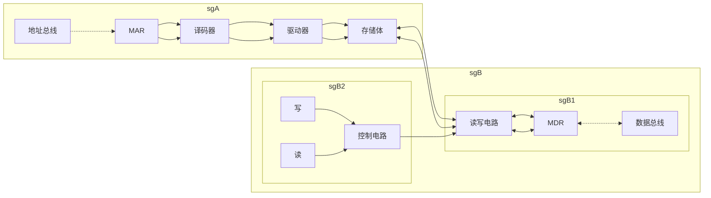

# 主存储器

```mermaid
graph LR
	A[存储体]
	B[读写电路]
	C[MDR]
	D[控制电路]
	E[驱动器]
	F[译码器]
	G[MAR]
	
	subgraph sgA
		direction BT
		地址总线-..->G-->F-->E-->A
		G-->F-->E-->A
	end
	direction TB
	subgraph sgB
		direction TB
		subgraph sgB1
			direction TB
			A <--> B <--> C <-..-> 数据总线
			A <--> B <--> C
		end
		subgraph sgB2
			direction TB
			写--> D
			读--> D --> B
		end
	end

```

![[2026-03-11_200042.svg]]